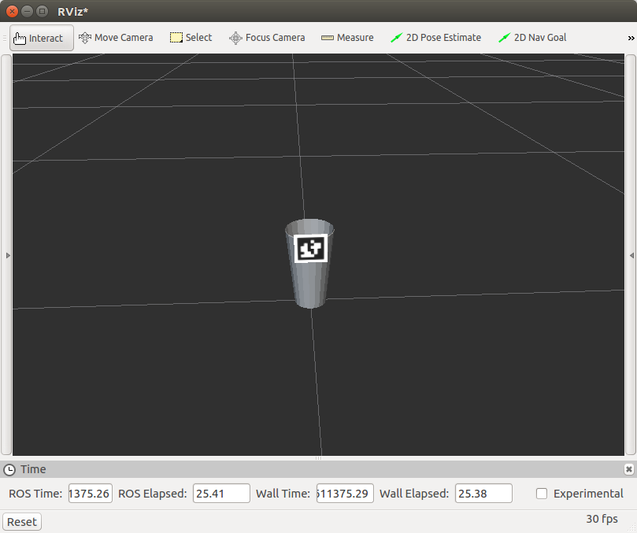
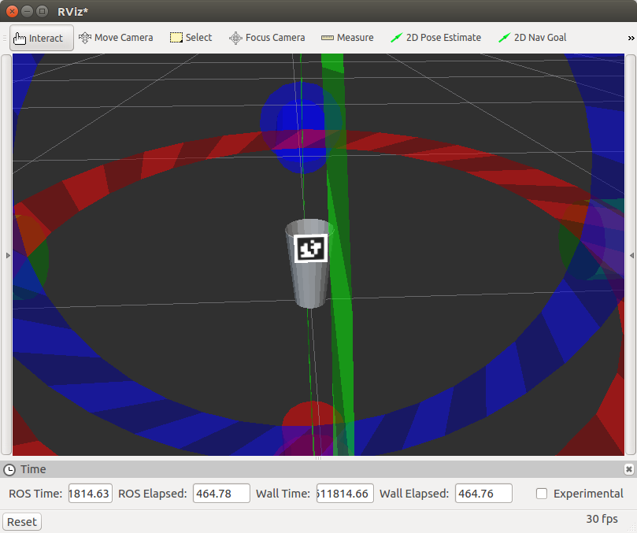

# kinbody_detector
Builds kinbodies from MarkerArray 

This page describes the process for using apriltags to detect objects.

What you will need:

1. A physical object.
2. A corresponding kinbody.
3. An apriltag sticker or card.

## Creating a KinBody

We use the [`.kinbody.xml` format](http://openrave.programmingvision.com/wiki/index.php/Format:XML#KinBod) tyo represent objects in OpenRAVE. Apriltags detects rigid bodies, so the kinbodies created by apriltags typically consist of one link and no joints.

The following `.kinbody.xml` file creates a (1 m x 2 m x 3 m) box centered at the origin:
```xml
<Body name="Body1" type="dynamic"> <!-- Set "name" to the default name of the KinBody. -->
  <Geom type="box">
    <AmbientColor>0.5 0.5 0.5 1.0</AmbientColor> <!-- RGBA color -->
    <DiffuseColor>0.5 0.5 0.5 1.0</DiffuseColor> <!-- RGBA color -->
    <Extents>1.0 2.0 3.0</Extents> <!-- x, y, and z half-extents, centered at the origin -->
    <Translation>0.0 0.0 1.5</Translation> <!-- translation of the origin -->
  </Geom>
</Body>
```

We typically put the origin of our kinbodies bottom-center of the model, so the object appears to be resting on the xy-plane when placed at the origin.

## Printing a Tag

1. Choose an unused tag ID in the "36h11" family. You can find a list of used tags in the [`data/objects/tag_data.json` file](https://github.com/personalrobotics/pr-ordata/blob/master/data/objects/tag_data.json) in the [`pr-ordata` repository](https://github.com/personalrobotics/pr-ordata).

2. Find the corresponding `tag36_11_00xxx.png` file in the [`data/tags/textures/tag36h11` directory](https://github.com/personalrobotics/kinbody_detector/tree/master/data/tags/textures/tag36h11) in this repository.

3. Use ImageMagick to convert the `.png` file to a `.pdf` that is suitable for printing:
  ```console
  $ convert tag36_11_00XXX.png -density 300 -interpolate Nearest -filter point -resize 708x708 tag36_11_00XXX.pdf
  ```
  The output is a 4.8 cm tag surrounded by 0.6 cm of padding (6 cm square total).

4. Print this tag at 100% scale.

## Adding the Tag to the Database

1. Run `tag_kinbody` script on your `.kinbody.xml` file and specify the tag index that you chose above:
  ```console
  $ rosrun kinbody_detector tag_kinbody.py --body PATH/TO/MY.kinbody.xml --index XXX --offsetpath PATH/TO/tag_data.json
  ```
  This script assumes that you are using the default tag size (4.8 cm on HERB) by default. If your tag has a different size, use the `--width` option to specify the size.
  
  On HERB, you should set `--offsetpath` to `$(rospack find pr_ordata)/data/objects/tag_data.json`. For example, to tag the glass used in the `table_clearing` demo, you would run:
  ```console
  $ rosrun kinbody_detector tag_kinbody.py -b pr_ordata/data/objects/glass.kinbody.xml -i 124 -o pr_ordata/data/objects/tag_data.json
  ```
  
  This will launch an `or_rviz` window with two objects present: (1) the kinbody specified by `--body` and (2) the apriltag specified by `--index`. It also opens an `IPython` terminal that you can use to interact with the environment.
  
  
  
3. If you are updating an existing model, run `read()` in the IPython terminal to load the pose of the tag from the JSON database.
  
4. Right click on the apriltag and choose `Body > Pose Controls`. This will create translation and rotation handles that allow you to move the pose of the apriltag in the environment.

  

5. Use the handles to position the apriltag correctly relative to the model. Be careful to match the orientation of the tag correctly - it's easy to accidentally rotate the tag by 90 degrees.

6. When you are done, type `write()` in the `IPython` terminal to save your changes to the JSON database file.

7. Commit the changes to the JSON database file.


## Detection

1. Now that you have your offset file created, you convert apriltag detections to kinbodies in OpenRAVE. In Python, you can now run:
  ```python
  import kinbody_detector.kinbody_detector as kd
  detector = kd.KinBodyDetector(env, '/PATH/TO/tag_data.json', '/PATH/TO/KINBODY/FOLDER', '/apriltags/marker_array')
  ```
  This creates a `detector` object that you can use to update the environment with detected kinbodies.

2. To update the environment with the most recent apriltag detections run:
  ```python
  detector.Update()
  ```

3. This system does not update live, so you must continue to run `detector.Update()` whenever you want to get a new snapshot of the physical world.
